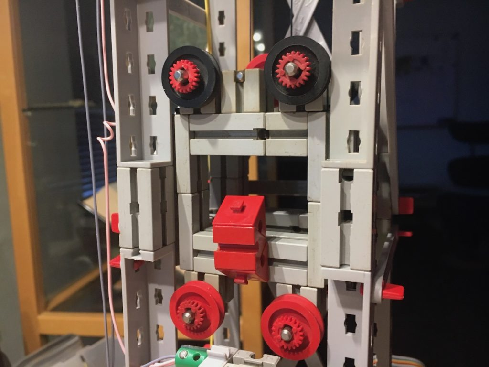
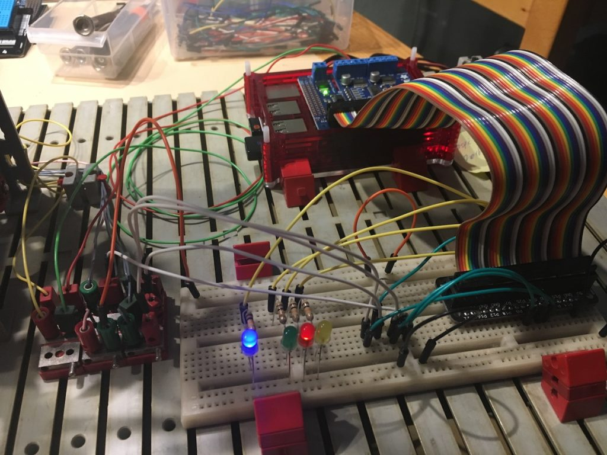

# README
This Python program, **`elevator.py`**, controls a model of an elevator with four floors using a Raspberry Pi.

## History
I have been interested in the principals of controlling elevators for a long time, without studying the subject. A while ago I decided to just go forth and build me a model that I then could control with my Raspberry Pi. The initial result is here in this repository.

At this moment (January 1, 2017) It is working reliably.

## Construction
I constructed the code in two python programs. the original program I started out with is called **`elevator.py`**. It contains all of the main control code and the command interpreter. It used to ask for commands of the keyboard, but when it was doing that tha processing did not proceed properly.

So I rebuilt that part to accept it's commands from a sequential file. I then had to build a second program to insert commands into that sequential file. This second program is appropriately called **`elevator_remote.py`**.

And because I didn't want to have two terminal screens open, as a third part I created a script **`elev`** that starts the main engine in the background and then boots up the remote.

## Libraries
The libraries used in this project are:
* ADAFRUIT_MotorHAT, used for
	* motor control
* collections - deque, used for
	* the creation of a queue mechanism
* atexit, used for
	* registering a routine that is executed at program end
* logging, used for
	* giving messages thoughout the program
* pigpio, used for
	* controlling the input switches
		* callback interrupt routines
	* controlling the output LED's
* time, used for
	* knowing the time, timing interrupts

## Commands
When the program is running, it presents the user with a prompt: "**`Remote input > `**" to indicate it expects a command. type **`h`** or **`help`** to see which command are available.

## License / availability
This software is available under the conditions of the GNU General Public License. 
See the [License file](./LICENSE) for further details.

## Use at own risk
Usage of this program is at the user's own risk, author will not be held responsible for any damage to your hardware. Especially the connection of wires to the correct Pi terminals has to be done with the greatest possible care.

## See also:
[Readme file](./README.md)

[Roadmap or TODO file](./TODO.md)

[License file](./LICENSE)
